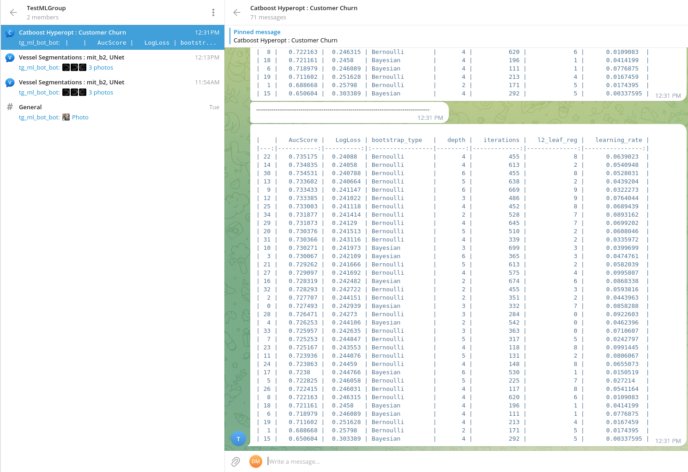

# Telegram bot ML stats.
This repository contains code for simple telegram bot for logging ML metrics.

## Installation
```
pip install tg-bot-ml
```

## Package description.

There are two python class to log metrics.

###  <b>TGTableSummaryWriter</b>
This writer is usefull for logging hyperparameters optimization or when you need log only numeric values. <br>
<b>Example:</b> <br>


<b>For more information see example :</b> examples/hyperparams_gb.py

### <b>TGImgSummaryWriter</b>
This writer could be used for logging neural networks metrics per epoch. <br>
<b>Example:</b> <br>


<b>For more information see example : </b> examples/tg_bot_nn_segmentation.py

## Setup ml bot.

1. Create telegram bot. Save token.
2. Create public telegram group.
3. Add your bot to this group. Make him an administrator.
4. Run following code
    ```
    from tg_bot_ml.utils import create_credentials

    create_credentials(BOT_TOKEN, PUBLIC_CHAT_NAME, './credentials.yaml')
    ```
5. Make your group private.

In the end you will have file credentials.yaml that you can use to log into this group.

<b>For example</b> :
```
from tg_bot_ml.table_bot import TGTableSummaryWriter

if __name__ == '__main__':
    tg_bot = TGTableSummaryWriter('../credentials.yaml', 'Catboost Hyperopt : Customer Churn')
    tg_bot.add_record(lr=1e-3, n_estimators=100, MSE=1.3)
    tg_bot.send(sort_by="MSE", ascending=False)
```