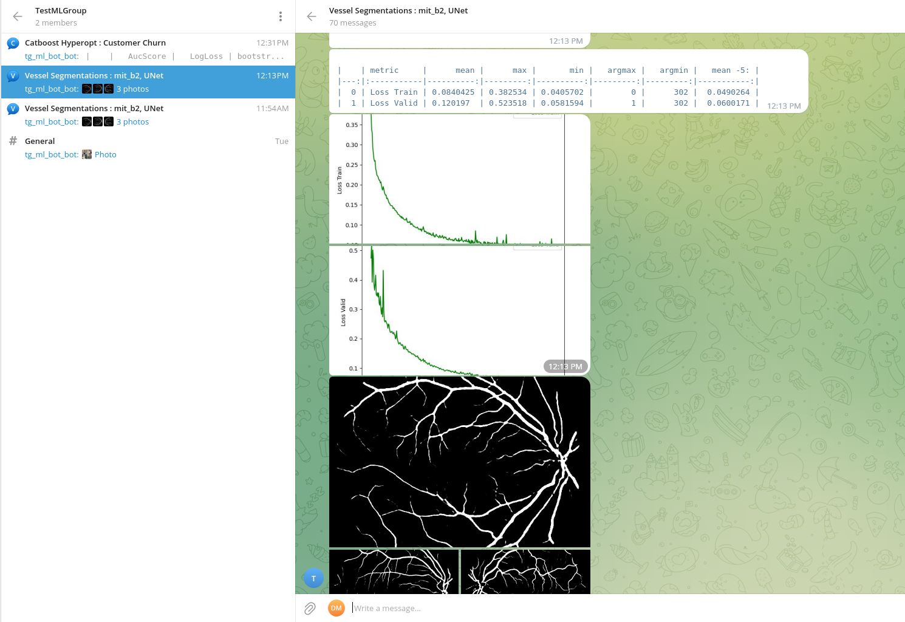

# telegram-ml-bot-stats
This repository contains code for simple telegram bot for logging ML metrics.

## Installation
```
pip install tg-bot-ml
```

## Usage

There are two python class to log metrics.

-  <b>TGTableSummaryWriter</b> <br>
    This writer is usefull for logging hyperparameters optimization or when you need log only numeric values. <br>
    <b>Example:</b> <br>
    

    For more information see example : examples/hyperparams_gb.py

-   <b>TGImgSummaryWriter</b> <br>
    This writer could be used for logging neural networks metrics per epoch. <br>
    <b>Example:</b> <br>
    

    For more information see example : examples/tg_bot_nn_segmentation.py

    
    
